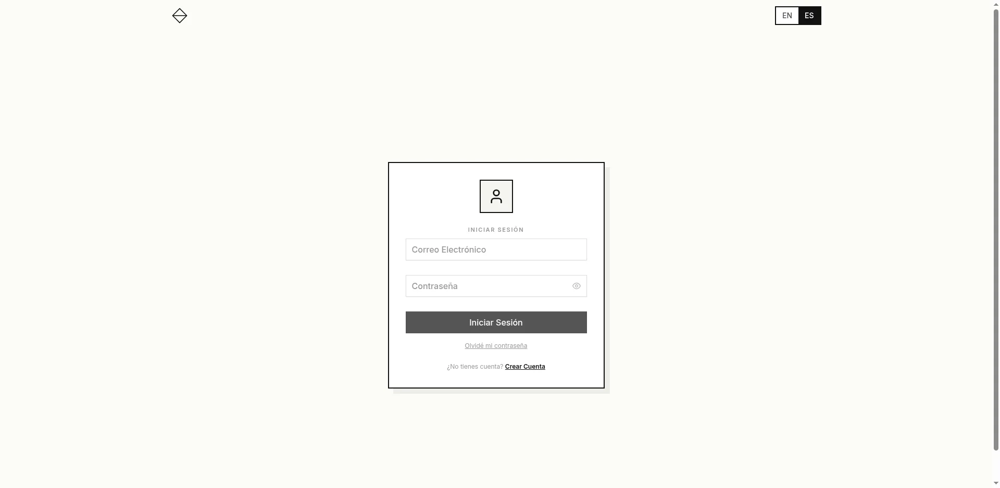
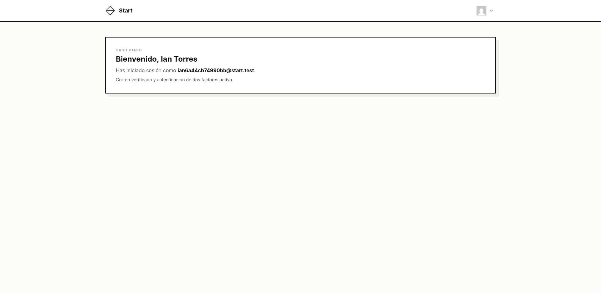
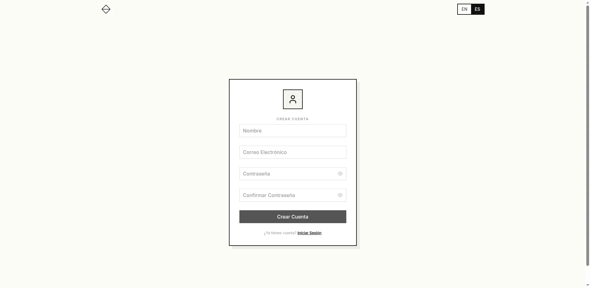
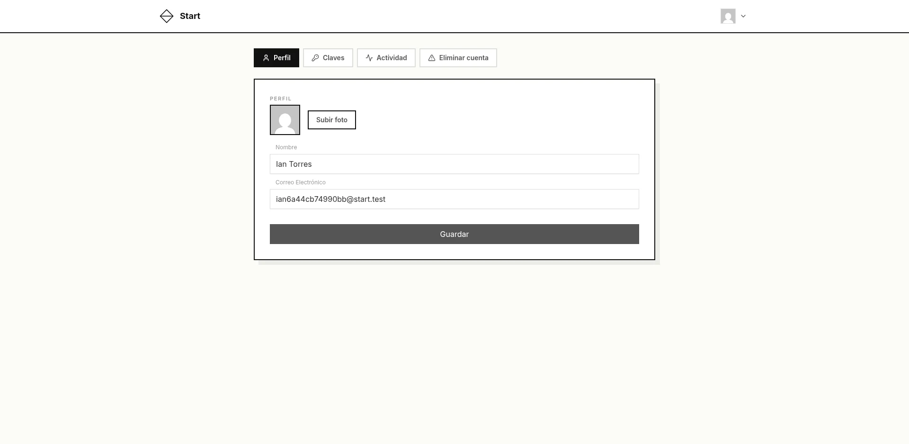
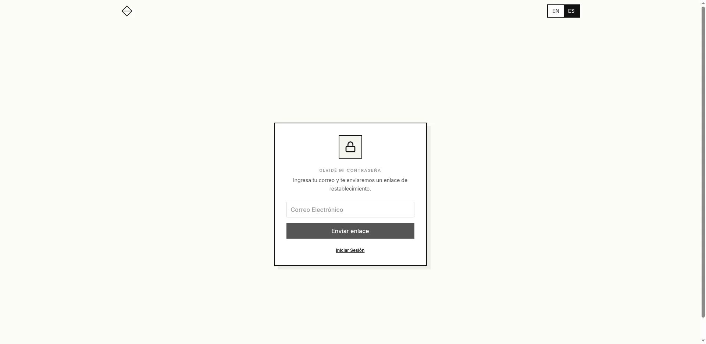
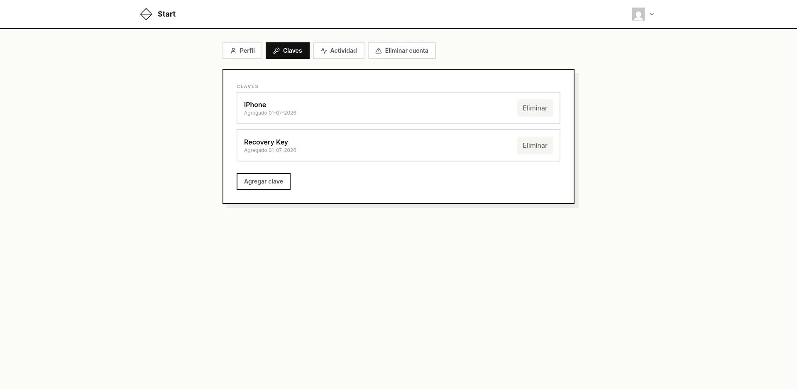
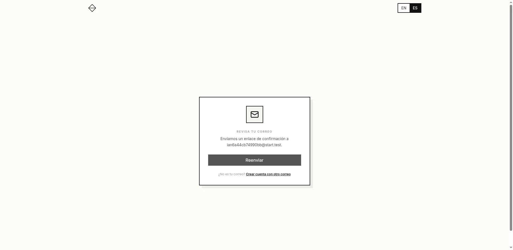
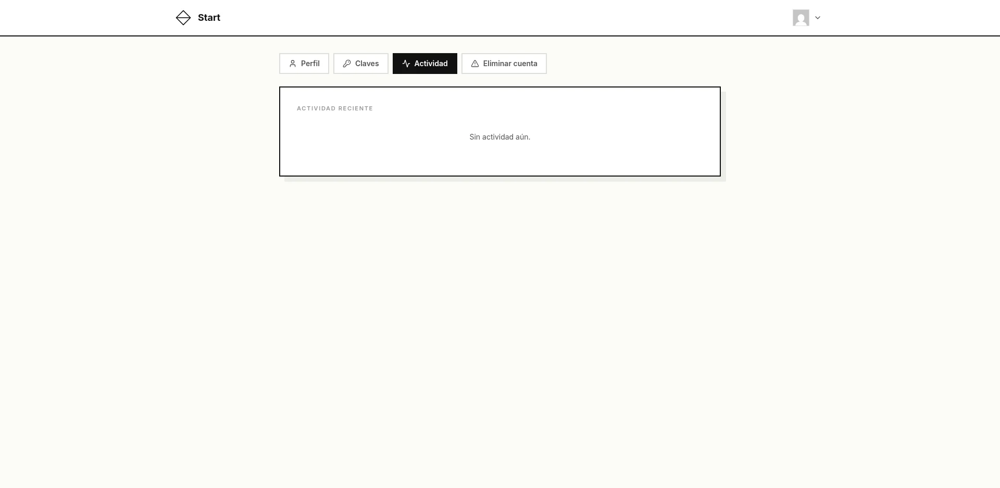
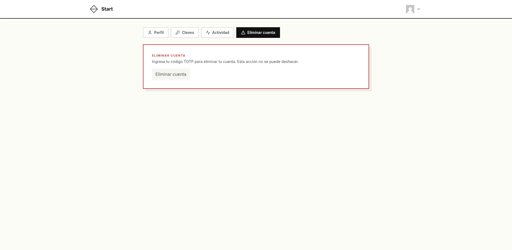

# Start

Base project for Laravel + Vue 3 authentication systems with multi-factor authentication, i18n, and accessibility.

## Stack

| Layer | Tech |
|---|---|
| Backend | PHP 8.4, Laravel 13 |
| Frontend | Vue 3, TypeScript, Pinia, Vue Router |
| UI | Tailwind CSS v4, PrimeVue 4, Lucide icons |
| i18n | vue-i18n (frontend), Laravel lang files (backend) |
| Testing | PHPUnit, Vitest, Playwright + axe-core |
| Multi-factor | TOTP (otphp), RSA-OAEP challenge tokens |

## Screenshots

| Auth pages | Dashboard & Settings |
|---|---|
|  |  |
|  |  |
|  |  |
|  |  |
| |  |

## Features

- **Registration** — name, email, password, email verification
- **Login** — email + password, TOTP challenge if configured
- **Password reset** — email link, TOTP verification required if device configured
- **Multi-language** — English/Spanish, persists locale, emails in user's language
- **TOTP devices** — multiple devices, setup with QR + RSA encrypted secret exchange, last device protection
- **Profile settings** — name, email (re-verification), avatar (Gravatar + upload), activity log
- **Activity log** — login attempts + TOTP usage history
- **Accessibility** — WCAG AA compliant, keyboard navigation, screen reader attributes, axe audits
- **API locale** — `X-Locale` header drives backend translations

## Requirements

- PHP 8.4+
- Node.js 22+
- Composer
- Yarn

## Quick Start

```bash
cp .env.example .env
composer install
yarn install
php artisan key:generate
php artisan storage:link
php artisan migrate
php artisan serve
yarn dev
```

## Tests

```bash
# Backend
php artisan test

# Frontend unit
yarn test:unit

# Frontend coverage
yarn test:unit:coverage

# E2E (requires servers running)
yarn test:e2e

# TypeScript check
yarn typecheck
```

## Architecture

### Auth Flow

```
Register → email verification → TOTP setup → Dashboard
Login    → email verified? → TOTP? → verify → Dashboard
```

### Token System

Custom encrypted-signed JWT tokens:

```
Token = AES-256-GCM( payload + HMAC-SHA256(payload) )
         + RSA-OAEP encrypted AES key
         + IV + GCM tag
```

- Signing: HMAC-SHA256 with `JWT_SIGNING_KEY` (separate from `APP_KEY`)
- Encryption: RSA-2048 OAEP (public/private key pair)
- Token types: `auth` (API auth), `request` (granular ops), `totp_challenge` (TOTP setup)

### API Endpoints

| Method | Path | Auth | Description |
|---|---|---|---|
| POST | `/api/auth/register` | — | Register with name, email, password |
| POST | `/api/auth/login` | — | Login, returns `totp_status` + `temp_token` |
| GET | `/api/auth/verify-email/{token}` | — | Check verification token |
| POST | `/api/auth/verify-email` | — | Confirm email with password |
| POST | `/api/auth/resend-verification` | — | Resend verification (throttled) |
| POST | `/api/auth/password/email` | — | Send reset link |
| GET | `/api/auth/password/reset/{token}` | — | Check reset token, returns `has_totp` |
| POST | `/api/auth/password/reset` | — | Reset password (TOTP required if device exists) |
| POST | `/api/auth/totp/setup/init` | Challenge/Auth | Request ephemeral certificate |
| POST | `/api/auth/totp/setup/confirm` | Challenge/Auth | Confirm TOTP device with encrypted secret |
| POST | `/api/auth/totp/verify` | Challenge | Verify TOTP code, get auth token |
| GET | `/api/auth/profile` | JWT | Profile + TOTP devices |
| PUT | `/api/auth/profile` | JWT | Update name, email, locale |
| POST | `/api/auth/profile/photo` | JWT | Upload avatar |
| POST | `/api/auth/profile/delete` | JWT | Delete account (requires TOTP) |
| POST | `/api/auth/totp/devices/delete` | JWT | Remove TOTP device (last device blocked) |
| GET | `/api/auth/activity` | JWT | Login + TOTP activity log |

### Frontend Routes

| Path | Component | Auth |
|---|---|---|
| `/` | HomePage (redirects) | — |
| `/login` | LoginPage | Guest |
| `/register` | RegisterPage | Guest |
| `/forgot-password` | ForgotPasswordPage | — |
| `/reset-password/:token` | ResetPasswordPage | — |
| `/email/verify` | VerifyEmailPage | — |
| `/email/verify/:token` | ConfirmEmailPage | — |
| `/totp/setup` | TotpSetupPage | — |
| `/totp/verify` | TotpVerifyPage | — |
| `/dashboard` | DashboardPage | Required |
| `/settings` | SettingsPage | Required |
